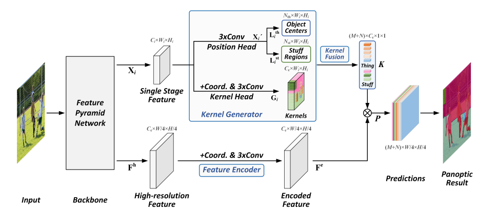
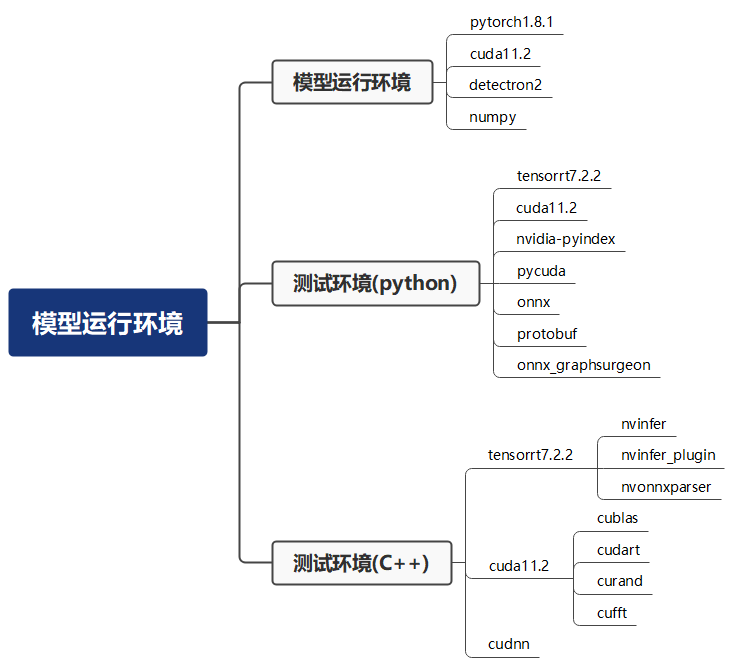
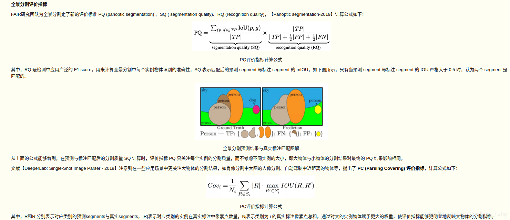
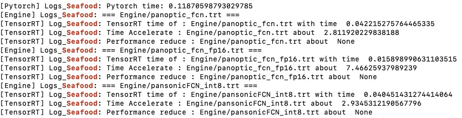
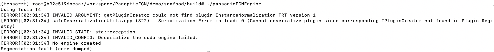
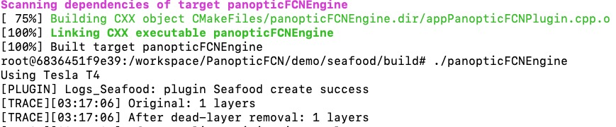

# Panoptic Segmentation的模型部署及TRT加速
本仓库基于NVIDIA-阿里 2021 TRT 比赛hackthon，例程及环境配置来源于[trt-samples-for-hackathon-cn](https://github.com/NVIDIA/trt-samples-for-hackathon-cn.git)
## 1、模型来源
根据文章《Fully Convolutional Networks for Panoptic Segmentation》及其[Github](https://github.com/Jia-Research-Lab/PanopticFCN)源代码得到模型的训练过程。网络模型如下图所示。该网络用于全景分割。

## 2、环境搭建
本仓库使用
```bash
nvidia-docker pull nvcr.io/nvidia/tensorrt:21.02-py3
```
新建docker容器并在此基础上进行工作，具体环境配置过程见[传送门](https://github.com/NVIDIA/trt-samples-for-hackathon-cn/blob/master/hackathon/setup.md)

## 3、训练过程
训练得[Engine/model_final.pth](Engine/model_final.pth)
## 4、pytorch -> onnx
```
python3 export_onnx.py --config-file ../Engine/PanopticFCN-R50-400-3x-FAST-nodeform.yaml --opts MODEL.WEIGHTS ../Engine/model_final.pth
```
导出onnx文件[panoptic_fcn.onnx](Engine/panoptic_fcn.onnx)
## 5、onnx -> trt
### 5.1 trt.FP32
```
trtexec --verbose --onnx=panoptic_fcn.onnx --saveEngine=panoptic_fcn.trt --explitBatch
```
### 5.2 trt.FP16
```bash
trtexec --verbose --onnx=panoptic_fcn.onnx --saveEngine=panoptic_fcn_fp16.trt --explicitBatch --fp16
```
### 5.3 trt.INT8
#### 校准集准备
在[testpics](tespics)文件夹下准备足量照片（>batch_size*max_batch）或者修改[tools/build_int8_engine](tools/build_int8_engine)中的文件类型和路径，设定batch_size。校准过程见[calibrator.py](tools/calibrator.py)。
#### 引擎生成
```bash
python tools/build_int8_engine
```
#### 引擎储存路径
文件会被储存在tools/models_save文件夹下，如没有特别标注不会生成panoptic_fcn_int.cache描述文件。为方便调用将该文件夹下的panoptic_fcn_int8.trt放于Engine文件夹下:
```bash
mv tools/models_save/panoptic_fcn_int8.trt Engine/
```
不建议使用cp命令，若models_save拥有trt文件的话会首先读入该引擎文件造成混淆。
## 6、TRT引擎加速效果
运行appOnnxPanopticFCN.py文件获得
```bash
python appOnnxPanopticFCN.py --config-file Engine/PanopticFCN-R50-400-3x-FAST-nodeform.yaml --opts MODEL.WEIGHTS Engine/model_final.pth
```
性能表现：因为在全景分割中每一个像素点都会被准确的分配到某个类别中，所以本程序所使用的效果对比为PQ函数（全景分割评价指标），该标准对应的模型输出即 output['scores'] 这个输出

分别使用FP32、FP16和INT8模型进行模型部署，使用单张照片作为测试照片输入。测试结果如下：

|  | FP32 | FP16 | INT8 |
| ------ | ------ | ------ | ----|
| 运行时间 | 0.042133 | 0.015947 | 0.03828|
| 加速比 | 2.87 | 7.59 | 3.16 |
| scores减比 | -6e-6 | 2e-4 | -6e-6|

在FP32和INT8中scores增加，可能是因为在训练中模型有过拟合现象。同时INT8的加速比并没有想象中的理想，推测原因是模型过于复杂导致在生成onnx或者trt模型时没有充分的生成trt可加速的layer。
## 7、C++中的模型部署
```bash
mkdir build && cd build
cmake ..
make
./pansonicFCNEngine
```
#### [BUG] INVALID_ARGUMENT: getPluginCreator could not find plugin InstanceNormalization_TRT version 1

改错误是因为没有开启调用TRT系统已经写好的Plugin，在C代码生成Engine之前加入一句：
```C
initLibNvInferPlugins(&trtLogger,"");
```
### 8、简单ReLU plugin的实现
本代码因为时间关系没有实现过于复杂的plugin，但是为了学习plugin操作实现了一个ReLU的plugin，源代码位于[appPanopticFCNPlugin.cpp](appPanopticFCNPlugin.cpp)。更改[CMakelists.txt](CMakelists.txt)中的
```cmake
#添加文件
add_executable(${PROJECT_NAME} appPanopticFCNPlugin.cpp
```
进行7中的模型部署编译运行。

老板们觉得有用的话给个star叭🌟！
